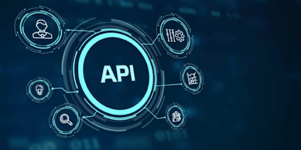

<h1 align="center" id="Title">
<a href="https://api-rest-nc.up.railway.app/" alt="API REST">

API REST
</a>
</h1>

<h2 id="Description">Project Description</h2>

This is a backend project made with MongoDB Atlas as the database, where you will find three endpoints:

- **./api/item:** with the four basic CRUD operations.
- **./api/auth:** with two POST operations. One to **./register** and, the other to **./login**.
- **./api/order**: with one GET operation. To access this route, you will need to send JSON Web Token in the header. To obtain the token, you must first log in.

<h2 id="Indice">Indice</h2>

- [Title](#Title)

- [Project Description](#Description)

- [Indice](#Indice)

- [Project status](#Status)

- [Project features](#Features)

- [Access to projects](#Acces)

- [Used technologies](#Technologies)

<h2 id="Status">Project Status</h2>

 ✅ FINISHED ✅

<h2 id="Status">Project Features</h2>

### Item Route

The first route is the item route (./api/item). Here, you will be able to perform the four basic CRUD operations. Additionally, to update, delete, or retrieve only one item, you will need to send its ID as a parameter in the URL.

### Auth route

The second route is the Auth route (./api/auth). To register a new user, you will need to send a [POST] request to "./register". To log in, you should send a [POST] request to "./login". After a successful login, you will receive a JSON Web Token that will allow you to access the order route (./api/oreder).

### Order route

The third route is the order route (./api/order). To access it, you will need to include a JSON Web Token in your request headers. You can obtain this token by logging in through the Auth route.

<h2 id="Acces">Access to projects</h2>

-  [**Open in browser**](https://api-rest-nc.up.railway.app/)

-  [**GitHub Repository**](https://github.com/NaimCBGhassan/ApiRest)

<h2 id="Technologies">Used technologies</h2>

### BackEnd

<ul >
  <li>NodeJs</li>
  <li>TypeScript</li>
  <li>ExpressJs</li>
  <li>MongoDB</li>
  <li>Mongoose</li>
  <li>JSON Web Token</li>
  <li>BcryptJS</li>
  <li>Cors</li>
  <li>Dotenv</li>
  <li>Morgan</li>
</ul>
